# Pruebas de Usuario Realizadas y Trazabilidad a Codigo

## 1. Objetivo de este documento

Este documento describe las pruebas de usuario realizadas sobre todo el proyecto y, para cada caso, identifica exactamente que parte del codigo hace que ese comportamiento funcione.

## 2. Cobertura funcional probada

Se han cubierto estas areas:

1. Autenticacion y seguridad
2. Registro con validaciones y geolocalizacion
3. Flujo cliente (catalogo, carrito, checkout, pedidos, perfil)
4. Flujo administrador (usuarios, estadisticas, perfil)
5. Flujo logistica (dashboard, pedidos, productos, perfil)
6. Responsive del area cliente y pantallas de acceso

## 3. Matriz de pruebas realizadas + codigo responsable

### UAT-01 Login correcto

- Que se probo:

1. Iniciar sesion con credenciales validas
2. Ver redireccion segun rol

- Resultado observado:

1. Sesion creada correctamente
2. Navegacion automatica al area del rol

- Codigo responsable:

1. [src/app/shared/components/login/login.component.ts](src/app/shared/components/login/login.component.ts): `login()`
2. [src/app/core/api.service.ts](src/app/core/api.service.ts): `login()`
3. [src/app/core/auth.store.ts](src/app/core/auth.store.ts): `setSession()`, `getDefaultRouteForCurrentRole()`

**Evidencia — Cliente:**

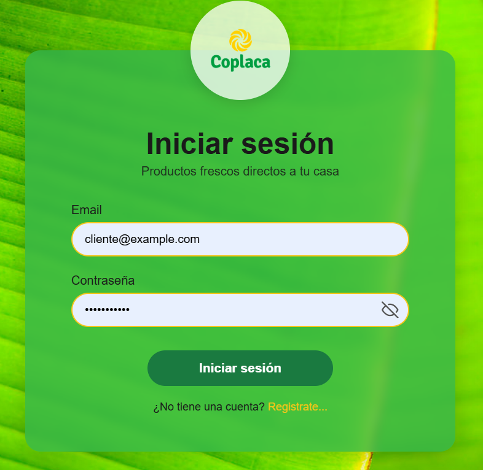
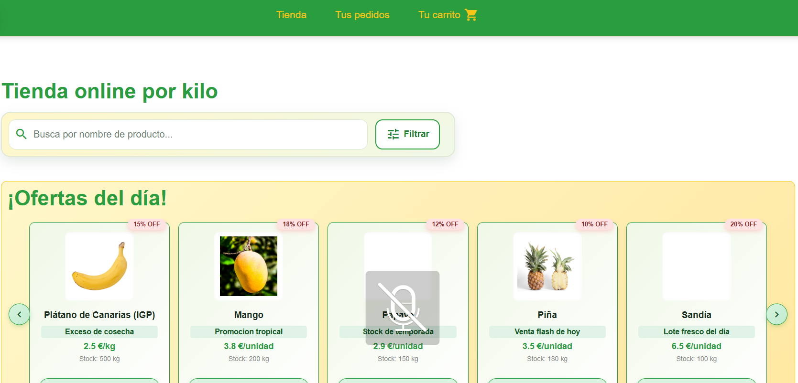

**Evidencia — Admin:**

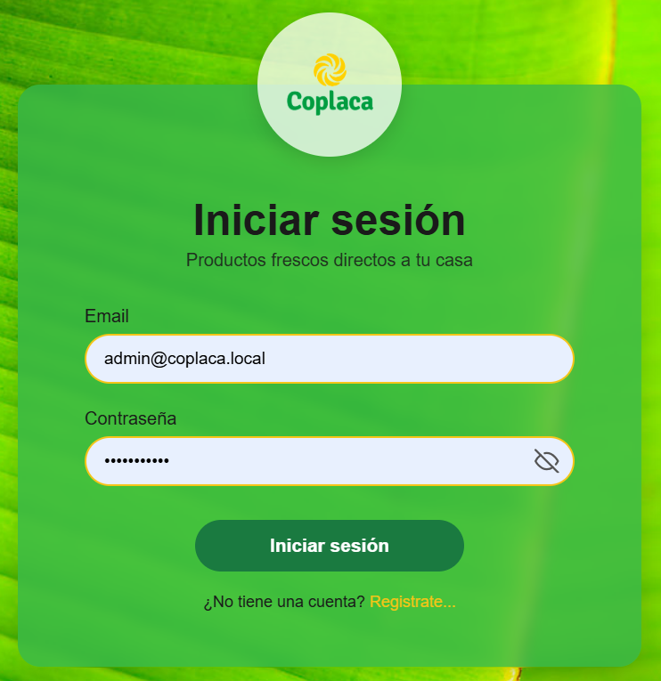
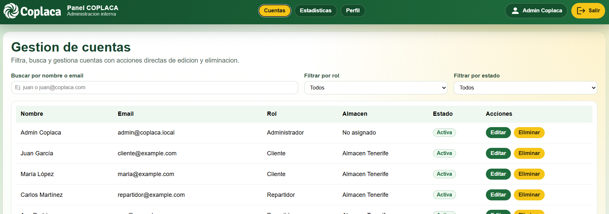

**Evidencia — Logistica:**

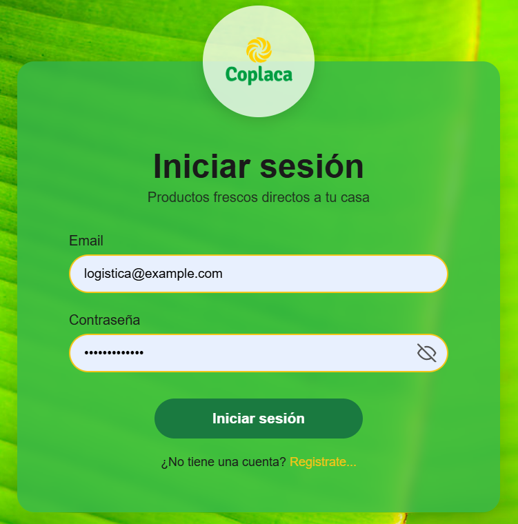
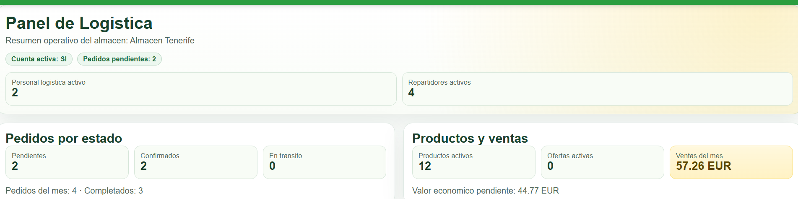

---

### UAT-02 Login con error

- Que se probo:

1. Credenciales invalidas
2. Mensaje de error de autenticacion

- Resultado observado:

1. No se abre sesion
2. Mensaje legible para usuario

- Codigo responsable:

1. [src/app/shared/components/login/login.component.ts](src/app/shared/components/login/login.component.ts): `extractLoginErrorMessage()`
2. [src/app/shared/components/login/login.component.ts](src/app/shared/components/login/login.component.ts): `extractBackendMessage()`

**Evidencia:**

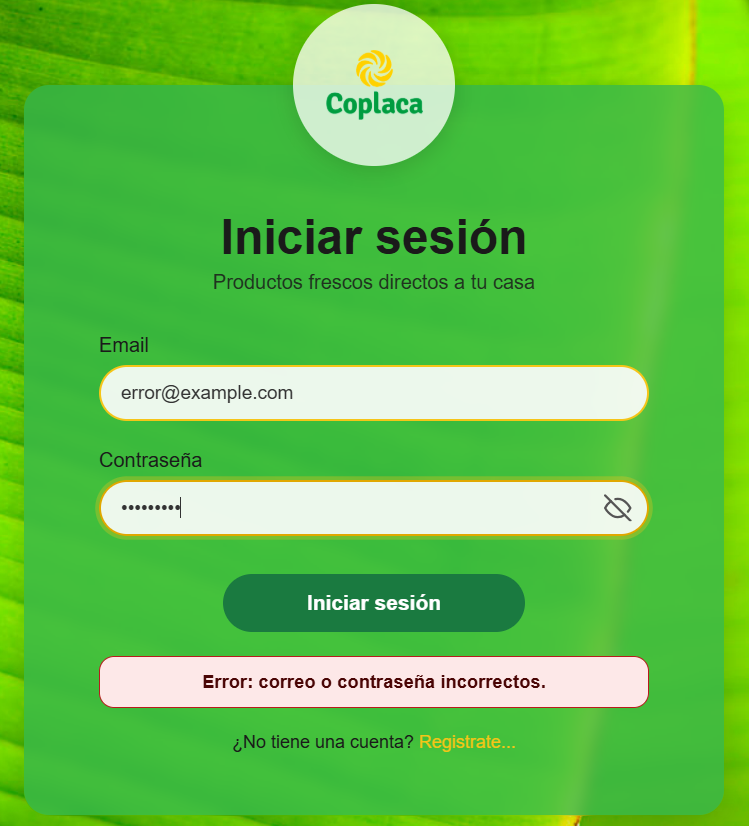

---

### UAT-03 Registro de usuario nuevo

- Que se probo:

1. Registro completo de cliente
2. Inicio de sesion automatico al finalizar

- Resultado observado:

1. Alta correcta
2. Redireccion a `/client/our-products`

- Codigo responsable:

1. [src/app/shared/components/register/register.component.ts](src/app/shared/components/register/register.component.ts): `openConfirmationModal()`, `register()`
2. [src/app/core/api.service.ts](src/app/core/api.service.ts): `signup()`
3. [src/app/core/auth.store.ts](src/app/core/auth.store.ts): `setSession()`

### UAT-04 Validacion de contrasena en registro

- Que se probo:

1. Reglas de contrasena (longitud, mayuscula, minuscula, numero)
2. Coincidencia entre contrasena y confirmacion

- Resultado observado:

1. Bloquea envio cuando no cumple
2. Lista de errores en pantalla

- Codigo responsable:

1. [src/app/shared/components/register/register.component.ts](src/app/shared/components/register/register.component.ts): `validatePassword()`

### UAT-05 Geolocalizacion por codigo postal y almacen cercano

- Que se probo:

1. Resolucion de direccion por codigo postal
2. Calculo de almacen mas cercano

- Resultado observado:

1. Coordenadas detectadas
2. Almacen sugerido correctamente

- Codigo responsable:

1. [src/app/shared/components/register/register.component.ts](src/app/shared/components/register/register.component.ts): `onPostalCodeChange()`, `resolveCoordinatesFromPostalCode()`, `updateNearestWarehouse()`
2. [src/app/core/address-geo.service.ts](src/app/core/address-geo.service.ts): `geocodeFromPostalCode()`, `getNearestWarehouse()`, `searchSuggestions()`

### UAT-06 Catalogo cliente: busqueda y filtros

- Que se probo:

1. Busqueda por texto
2. Filtros por categoria/oferta/stock/frescura

- Resultado observado:

1. Listado filtrado en tiempo real

- Codigo responsable:

1. [src/app/features/client/components/our-products/our-products.component.ts](src/app/features/client/components/our-products/our-products.component.ts): `onSearchInput()`, `getReactiveProducts()`, `setCategoryFilter()`
2. [src/app/core/api.service.ts](src/app/core/api.service.ts): `getProducts()`

**Evidencia:**

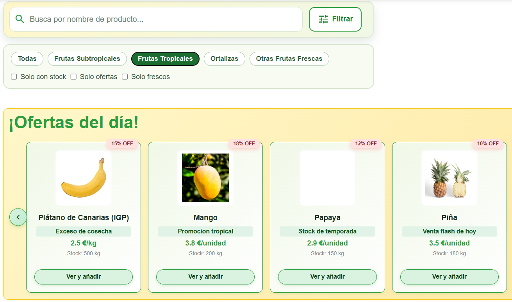

---

### UAT-07 Carrito: alta y edicion de items

- Que se probo:

1. Agregar producto desde catalogo
2. Incrementar/decrementar/eliminar item
3. Recalculo de totales

- Resultado observado:

1. Totales correctos y persistencia local

- Codigo responsable:

1. [src/app/features/client/components/our-products/our-products.component.ts](src/app/features/client/components/our-products/our-products.component.ts): `addToCart()`
2. [src/app/core/cart.store.ts](src/app/core/cart.store.ts): `addItem()`, `saveItems()`, `getItems()`
3. [src/app/features/client/components/cart/cart.component.ts](src/app/features/client/components/cart/cart.component.ts): `refreshCart()`, `increment()`, `decrement()`, `removeItem()`

**Evidencia:**

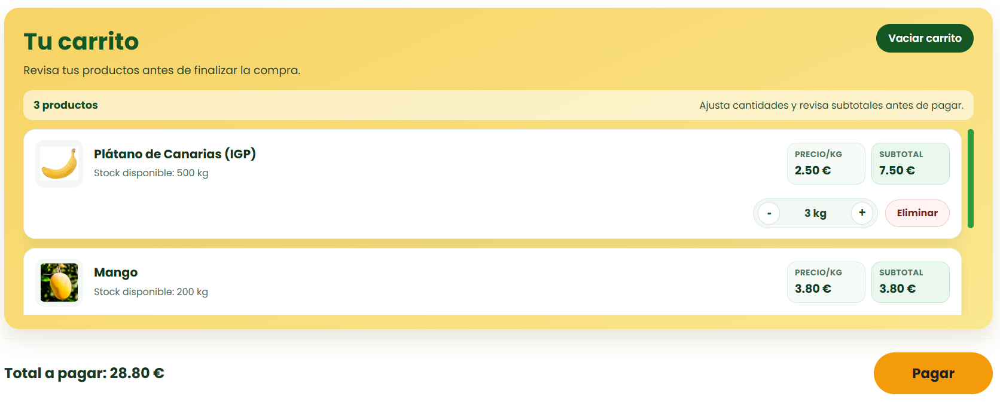

---

### UAT-08 Checkout/Pago y creacion de pedido

- Que se probo:

1. Validacion de metodos de pago
2. Creacion de pedido con API
3. Fallback local cuando falla API

- Resultado observado:

1. Flujo robusto con continuidad operativa

- Codigo responsable:

1. [src/app/features/client/components/cart/cart.component.ts](src/app/features/client/components/cart/cart.component.ts): `confirmarPago()`, `createOrder()`, `buildLocalOrderFromCart()`
2. [src/app/core/api.service.ts](src/app/core/api.service.ts): `createOrder()`
3. [src/app/core/order.store.ts](src/app/core/order.store.ts): `prependOrder()`

**Evidencia:**

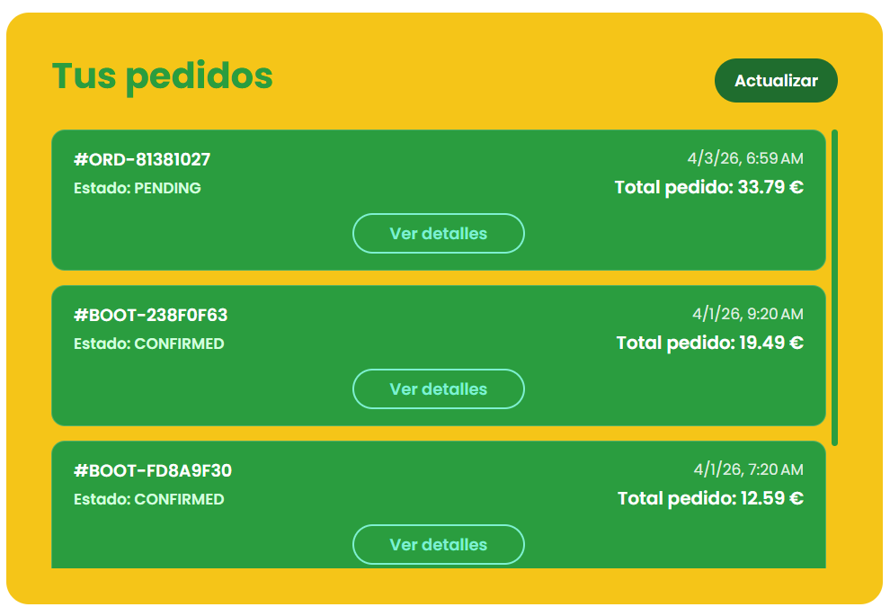

---

### UAT-09 Historial de pedidos y detalle

- Que se probo:

1. Carga de pedidos del usuario
2. Fusion de pedidos remotos y locales
3. Visualizacion de detalle

- Resultado observado:

1. Historial consistente incluso sin conexion

- Codigo responsable:

1. [src/app/features/client/components/orders/orders.component.ts](src/app/features/client/components/orders/orders.component.ts): `loadOrders()`, `verDetalles()`
2. [src/app/core/order.store.ts](src/app/core/order.store.ts): `mergeWithStored()`, `saveOrders()`
3. [src/app/core/api.service.ts](src/app/core/api.service.ts): `getMyOrders()`

**Evidencia:**

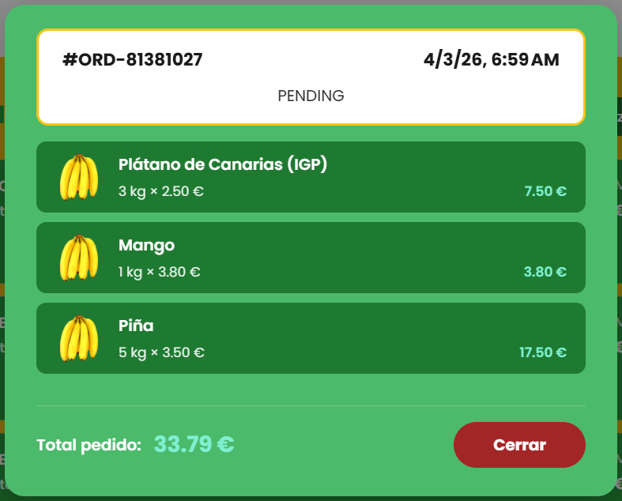

---

### UAT-10 Perfil cliente

- Que se probo:

1. Carga y edicion de datos
2. Guardado de direccion con coordenadas
3. Recarga de saldo local

- Resultado observado:

1. Datos actualizados y persistidos segun flujo

- Codigo responsable:

1. [src/app/shared/components/profile/profile.component.ts](src/app/shared/components/profile/profile.component.ts): `loadProfile()`, `saveInfo()`, `confirmarSaldo()`
2. [src/app/core/api.service.ts](src/app/core/api.service.ts): `getCurrentUser()`, `updateCurrentUser()`
3. [src/app/core/address-geo.service.ts](src/app/core/address-geo.service.ts): `geocodeFromParts()`, `getNearestWarehouse()`

### UAT-11 Seguridad por rol y rutas protegidas

- Que se probo:

1. Intentar entrar en rutas de otro rol
2. Manejo de token y errores 401

- Resultado observado:

1. Redireccion segura a ruta valida
2. Cierre de sesion en no autorizado

- Codigo responsable:

1. [src/app/guards/auth.guard.ts](src/app/guards/auth.guard.ts): `canActivate()`
2. [src/app/interceptors/jwt.interceptor.ts](src/app/interceptors/jwt.interceptor.ts): `intercept()`
3. [src/app/app.routes.ts](src/app/app.routes.ts): `data.roles` por modulo

### UAT-12 Admin usuarios (CRUD operativo)

- Que se probo:

1. Cargar usuarios
2. Editar datos/rol/estado
3. Eliminar usuario

- Resultado observado:

1. Cambios aplicados y mensajes correctos

- Codigo responsable:

1. [src/app/features/admin/components/users/admin-users.component.ts](src/app/features/admin/components/users/admin-users.component.ts): `loadUsers()`, `saveEdit()`, `applyRoleAndStatusChanges()`, `deleteUser()`
2. [src/app/core/api.service.ts](src/app/core/api.service.ts): `getAdminUsers()`, `updateAdminUser()`, `updateAdminUserRoles()`, `updateAdminUserStatus()`, `deleteAdminUser()`

### UAT-13 Admin estadisticas y perfil

- Que se probo:

1. Top productos vendidos
2. Estado de base de datos
3. KPIs agregadas de plataforma

- Resultado observado:

1. Dashboard con datos coherentes

- Codigo responsable:

1. [src/app/features/admin/components/stats/admin-stats.component.ts](src/app/features/admin/components/stats/admin-stats.component.ts): `loadStats()`, `checkDatabaseHealth()`
2. [src/app/features/admin/components/profile/admin-profile.component.ts](src/app/features/admin/components/profile/admin-profile.component.ts): `loadProfileData()`, `loadDashboardData()`

### UAT-14 Logistica pedidos (asignacion)

- Que se probo:

1. Carga de pedidos por almacen
2. Asignar pedido a repartidor
3. Refresco automatico

- Resultado observado:

1. Asignacion y actualizacion de estado correctas

- Codigo responsable:

1. [src/app/features/logistics/components/orders/logistics-orders.component.ts](src/app/features/logistics/components/orders/logistics-orders.component.ts): `resolveWarehouseAndLoad()`, `loadData()`, `assignOrder()`
2. [src/app/core/api.service.ts](src/app/core/api.service.ts): `getLogisticsAllOrders()`, `getAvailableDeliveryWorkers()`, `assignOrderToDelivery()`

### UAT-15 Logistica productos

- Que se probo:

1. Modificar stock
2. Modificar precio
3. Crear/editar oferta
4. Crear producto

- Resultado observado:

1. Operaciones reflejadas correctamente en UI

- Codigo responsable:

1. [src/app/features/logistics/components/products/logistics-products.component.ts](src/app/features/logistics/components/products/logistics-products.component.ts): `loadProducts()`, `updateStock()`, `updatePrice()`, `updateOffer()`, `createProduct()`
2. [src/app/core/api.service.ts](src/app/core/api.service.ts): `updateLogisticsProductStock()`, `updateLogisticsProductPrice()`, `createOffer()`, `updateOffer()`, `createLogisticsProduct()`

### UAT-16 Logistica dashboard y perfil

- Que se probo:

1. KPIs operativas por almacen
2. Resumen de estado de pedidos/repartidores

- Resultado observado:

1. Informacion consolidada correctamente

- Codigo responsable:

1. [src/app/features/logistics/components/dashboard/logistics-dashboard.component.ts](src/app/features/logistics/components/dashboard/logistics-dashboard.component.ts): `loadDashboard()`
2. [src/app/features/logistics/components/profile/logistics-profile.component.ts](src/app/features/logistics/components/profile/logistics-profile.component.ts): `loadProfile()`, `loadWarehouseData()`

### UAT-17 Responsive area cliente y pantallas de acceso

- Que se probo:

1. Login y register en movil
2. Modulo cliente en movil (layout, tienda, carrito, checkout, pedidos)

- Resultado observado:

1. Uso correcto en viewport movil sin roturas criticas

- Codigo responsable:

1. [src/app/shared/components/login/login.component.css](src/app/shared/components/login/login.component.css)
2. [src/app/shared/components/register/register.component.css](src/app/shared/components/register/register.component.css)
3. [src/app/features/client/layout/client-layout.component.css](src/app/features/client/layout/client-layout.component.css)
4. [src/app/features/client/components/our-products/our-products.component.css](src/app/features/client/components/our-products/our-products.component.css)
5. [src/app/features/client/components/cart/cart.component.css](src/app/features/client/components/cart/cart.component.css)
6. [src/app/features/client/components/checkout/checkout.component.css](src/app/features/client/components/checkout/checkout.component.css)
7. [src/app/features/client/components/orders/orders.component.css](src/app/features/client/components/orders/orders.component.css)

**Evidencia:**

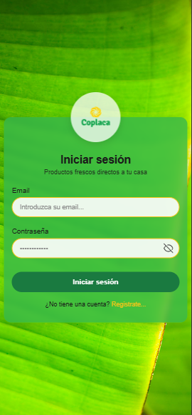
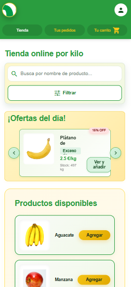

---

## 4. Componentes transversales que habilitan todas las pruebas

Estos archivos son la base comun que permite que los casos anteriores funcionen de extremo a extremo:

1. [src/app/app.routes.ts](src/app/app.routes.ts): define rutas y roles
2. [src/app/app.config.ts](src/app/app.config.ts): registra router, HTTP e interceptor
3. [src/main.ts](src/main.ts): arranque de aplicacion
4. [src/app/core/api-base-url.ts](src/app/core/api-base-url.ts): resolucion de URL API por entorno/runtime
5. [src/app/core/api.models.ts](src/app/core/api.models.ts): contratos DTO

## 5. Estado de ejecucion de pruebas (resumen)

- Casos ejecutados: UAT-01 a UAT-17
- Cobertura funcional: completa en modulos cliente, admin y logistica
- Cobertura tecnica: autenticacion, autorizacion, API, persistencia local, geolocalizacion y responsive

## 6. Plantilla para seguir registrando nuevas pruebas

Usar este formato para ampliar el documento en siguientes iteraciones:

1. ID de prueba
2. Pasos de usuario
3. Resultado observado
4. Resultado esperado
5. Estado (Aprobado/Rechazado)
6. Codigo responsable (archivo + metodo)
7. Evidencia (captura/video/log)
